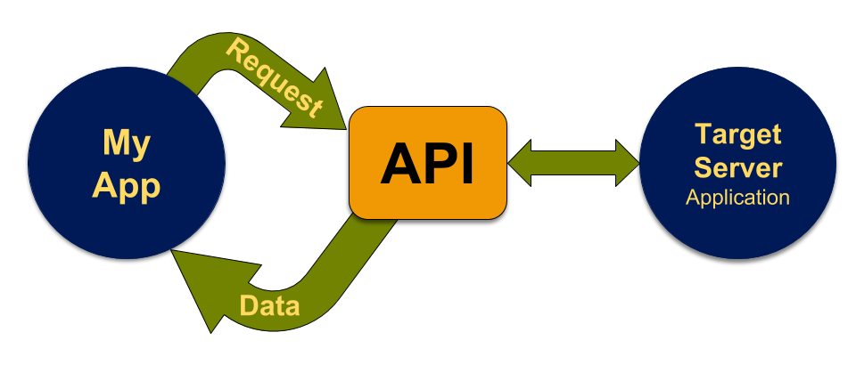

## Application Program Interface 

A set of rules and protocols used to build a software application.  In the context of Web Scraping an API is a method used to gather clean data from a website (i.e. data that is not wrapped in HTML, Javascript, bound in HTTP, etc.)

- Built for machine-to-machine interactions

- Instructions for programs



???

```
  +> Data Request +
  |               |  
  |               |  
my application    +> API  <--> Target Server (application)
          ^          |
          |          |
          +----------+
```
---
## Why Use APIs?

--

- Get data in BULK

    - frontier beyond curated datasets
    - better data structures and eliminates HTML (JSON is easier to parse)
    - Easier to generate tidy dataframes

--

## Intellectual Property must be considered

---
class: softblue

### Client / Server 

 

- Same as h2m but now m2m

---

### Simulation...

- Person enters a URL


--
    
- Client & server negotiate handshake (*dramatization...*)

--

.right[]

---

- Web Browser parses the HTML

--

.right[]

???

Ever seen HTML before?  
    
---
class: softblue
## JSON

* [Javascript Object Notation](https://en.wikipedia.org/wiki/JSON) is a language-independent data format
* Currently the most common data data format for asynchronous client/server communication format
* Consists of key-value pairs

```{json example}
# from https://en.wikipedia.org/wiki/JSON
{
  "firstName": "John",
  "lastName": "Smith",
  "isAlive": true,
  "age": 25,
  "address": {
    "streetAddress": "21 2nd Street",
    "city": "New York",
    "state": "NY",
    "postalCode": "10021-3100"
  },
  "phoneNumbers": [
    {
      "type": "home",
      "number": "212 555-1234"
    },
    {
      "type": "office",
      "number": "646 555-4567"
    },
    {
      "type": "mobile",
      "number": "123 456-7890"
    }
  ],
  "children": [],
  "spouse": null
}
```

---

## m2m -- development

- Make [OR] interface with the web API

- Same as h2m but now m2m

*dramatization...*

--

.right[]

---

## Demonstration

1. Import Data:  https://raw.githubusercontent.com/libjohn/openrefine/master/data/sample-us-address-data.csv

1. Make Full Address:

    -  `value + " " + cells["city"].value + " " + cells["state"].value + " " + cells["zip"].value`
    
1. Fetch from Google Geocoding API

    - `'https://maps.googleapis.com/maps/api/geocode/json?' + 'sensor=false&key=<<INSERT YOUR Google Console Key>>' + '&address=' + escape(value, 'url')'`  <br>
    (See slide notes in presenter mode  `p`)
    
1. JSON Viewer:  http://jsonviewer.stack.hu/  

1. Longitude: `value.parseJson().results[0].geometry.location.lng`
1. Latitude: `value.parseJson().results[0].geometry.location.lat`
    
???

Demonstration Notes:

**Need to Enable the Google Geocoding API**

1. https://console.developers.google.com
1. Enable APIs and Services ; search = `geocoding` ; select API
1. Enable
1. Credentials tab

1. http://v.gd/parsing3333 -- **OR** -- <br> https://docs.google.com/document/d/1ZiHC1v595tf2NAhv4vVdRYy-Ro78Bc37Y0gs1TfGBco/edit <br> Demonstrate JSON parsing with OpenRefine
        

---
background-image: url(images/keys6a.jpg)

## API Keys

.left-column[
- Keep your *Secret Key* to yourself
]

.right-column.pull-right[
- Keys are used by the API provider for tracking application usage  
]

&lt;!-- Image credit:  http://www.publicdomainpictures.net/view-image.php?image=167489  --&gt;

---
class: green

## Now You Try

1. [API and Parsing](https://libjohn.github.io/openrefine/hands-on-web-scraping.html)

1. [API with Keys](https://libjohn.github.io/openrefine/hands-on-web-scraping.html#keys)


---
class: middle, center
[Top / Table of Contents](index.html#3) | [NEXT More HTML Parsing)](parsing_html_openrefine_60.html)


---
```{r child = 'footer.Rmd'}

```
