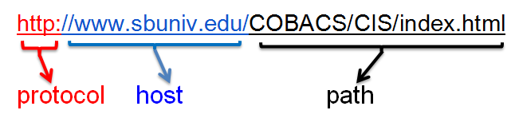

class: softblue

.pull-left[

## Scrape

 

Using tools to gather data you can see on a webpage

]

.pull-right[

## Parse

Analyzing the strings and symbols to reveal only the data you need


]

---
class: softblue

## HTML

Hypertext Markup Language

```{html}
<!DOCTYPE html>
<html>
<!-- created 2010-01-01 -->
 <head>
  <title>sample</title>
 </head>
 <body>
  <p>Voluptatem accusantium
   totam rem aperiam.</p>
 </body>
</html>
```

---

## URL



- Server sends back marked-up content

    - HTML
    - CSS StyleSheets
    - JavaScript
    
- Browser parses the HTML
    
---
## OpenRefine (Fetch & Parse)

- Scrape

    - Add column by fetching URL...
    
- Parse 

    - BeautifulSoup Libraries
         - Refine uses GREL Expressions to transform data
         - jSoup is a Java library implementation of BeautifulSoup -- a tool for HTML Extraction
    - Resources
        - [Workbook Exercise on HTML Parsing  ???  ](https://libjohn.github.io/openrefine/hands-on-web-scraping.html)
    - Documentation
        - [OpenRefine official documentation](https://github.com/OpenRefine/OpenRefine/wiki/StrippingHTML) on HTML Parsing
        - [CSS gamification documentation](http://flukeout.github.io/)
        - [jSoup Documentation](http://jsoup.org/cookbook/extracting-data/selector-syntax)

---
## Demonstration -- Process Outline

1. Fetch HTML by URL from Web Server

    - Edit column > Add column by fetching URL...

2. Parse HTML

    - Edit column > Add column based on this column
        - `parseHTML()`
        - `select("HTML/CSS handle")`
            - in Chrome:  highlight text > right-click > inspect (Chrome Developer Mode)
            - choose an array element, typically `[0]`
            - convert element:
                - `htmlText()`
                - `htmlAttr("attribute handle")`
                
---
###  Parsing by HTML elements and CSS

1. Edit Column > Add column based on this column

    - `value.parseHtml().select("div.contentdata")[0].htmlText()`
    - `value.parseHtml().select("title")[0].htmlText()`

###  Parsing by Brute Force

2. Edit Column > Add column based on this column

    - `value.split("</title>")[0]`
    - Edit Cells > Transform > `value.split("<title>")[1]`

---
class: green

## Now You Try It

1. [Step-by-Step Worksheet](https://docs.google.com/document/d/173DBCKrfXWT2yGlFeGQ-zaCh5TefwxctL1CoTTQTS1Y/):  Complete the *fetching* and *brute force* parsing method in steps 1-4

2. Complete the parsing example in Step 5

3. If you're speedy try the various parsing examples in step 6 

    - HTML Viewer: http://codebeautify.org/htmlviewer/

---
## Demonstrate -- Part 2

From price-press_releases.csv

- `value.parseHtml().select("div.contentdata")[0].select("strong")`

- `value.parseHtml().select("div.contentdata")[0].select("strong")[2].htmlText()`

- `value.parseHtml().select("div#centerbox")[0].select("a")[3].htmlAttr("href")`

- `forEach(value.parseHtml().select("div#centerbox")[0].select("a"),j,j.htmlAttr("href")).join("|||")`
    
---
class: middle, center
[Top / Table of Contents](index.html#3) 

---
```{r child = 'footer.Rmd'}

```

